# STM32H7RSWorkShop-Debug authentication demo

The example will guide you through a board provisionning with ST default secret, close the debug port of the  board. Then useing the debug authentication feature with certificate, you re-open the debugging link for debuging and also for triggering a regression  

## Prerequisites

- NucleoH7S3L8 board
- USB type C cable
- CubeIDE 1.15.1 (or upper) with STM32H7RSCube V1.0.0 (or upper)
- CubeProgrammer 2.16.0 (or upper)

## Key Steps for the Hands-On 
  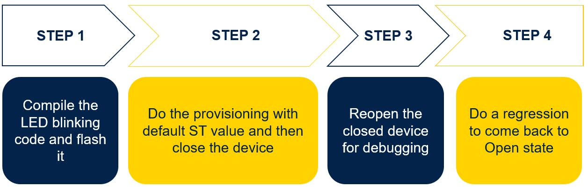
## Step 1 : Compile LED blonking code and flash it
### Import the project 
- Launch Cube IDE
- Go in Menu `File -> Open Projects from file system...`
- Select the folder `STM32H7RSWorkShop-Debug_authentication\0-LED blinking project\Test_LED`
- `Finish`
  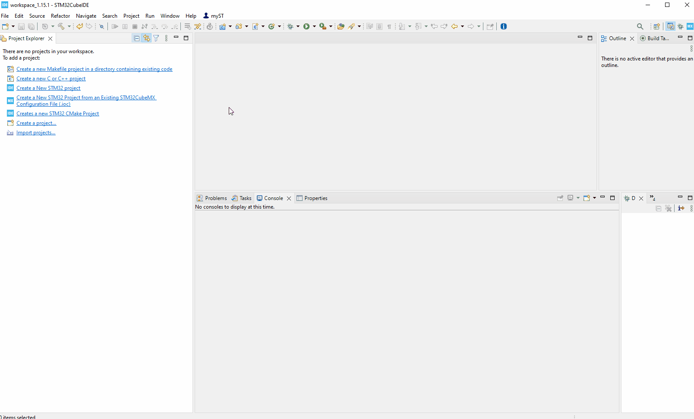
### Compile and download the project
- Select the `Test_LED_Boot`
- Go in Menu  `Run->Debug As-> 1 STM32C/C++ Application`
- Select debug configuration `Test_LED_Boot`, then `OK`
  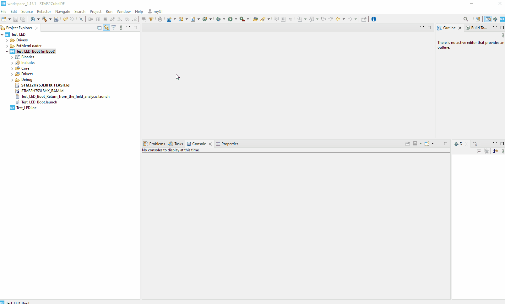
- Run the application, then stop the debug session
  
- LD2 orange is blinking 
## Step 2 : Provision the target with ST default credential and close the device
  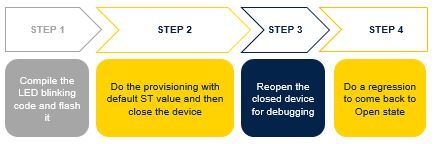
### 2.1 Let's provision the board !
- Launch STM32CubeProgrammer
- Select connect mode `Hotplug`
- Click on `Connect`
- Select icon for the option byte `OB`
- Select `Product State`
  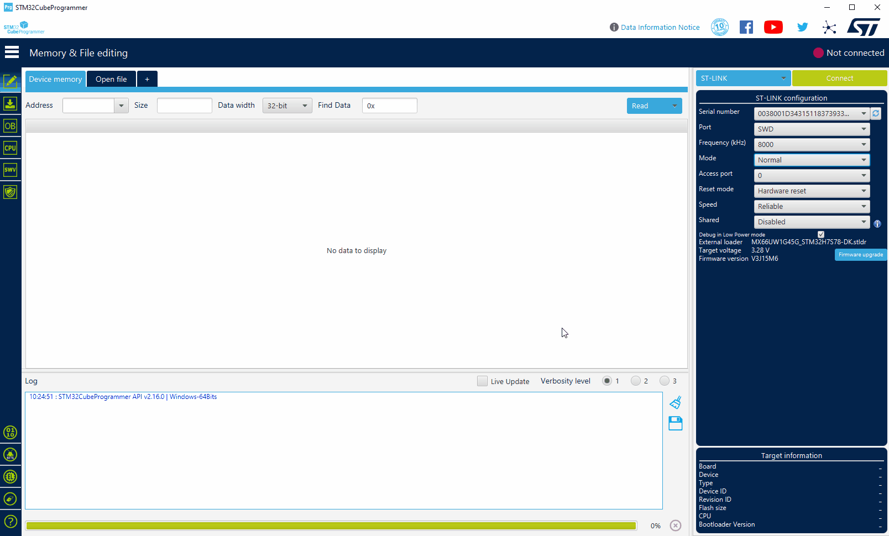
- Change the value from `39` to `17`
- Select  `Apply`
- On the pop-up "Do you want to provision a Deafult DA-Config? ", select `YES`
- On the Warning pop-up, click `OK`
- On the Message pop-up "OBKey Provisioned successfully....", click `OK`
- On the Message pop-up "Secure Option Byte set up succeeded", click `OK`
  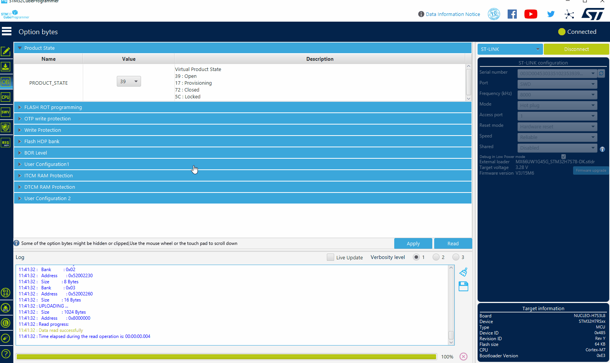
### 2.2 Let's close the board !
- Change product state value from `17` to `72`
- Select  `Apply`
- On the message pop-up : "Warning : Product state requested, verification could not be done", click `OK` 
- On the message pop-up : "Secure Option Byte set up succeeded", click `OK` 
- On the message pop-up : "Warning : Connection to device 0x.... is lost", click `OK` 
- On the message pop-up : "Error : failed to reconnect after reset", click `OK` 
  

The device is closed and our LED is blinking ! Device is ready to go on the field.

## Step 3 : Reopen the device for debug
  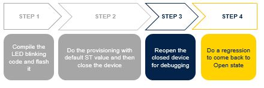
- Open STM32CubeIDE
- Select the `Test_LED_Boot`
- Go in Menu  `Debug configurations...`
- Select `Test_LED_Boot_Return_from_the_field_analysis`
- Select  `Debugger` tab
  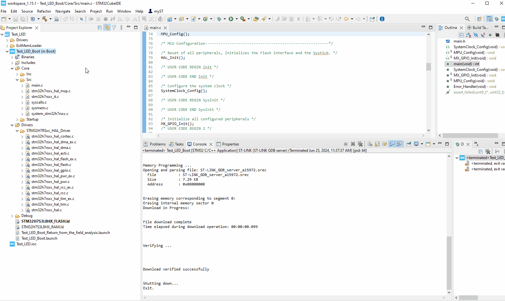
- In debug authentication update `Key path`, thanks `Browse...` to set it to your installation path
- `...STM32H7RSWorkShop-Debug_authentication\1-Debug_authentication\dbg_auth_pubkey.pem`
 - In debug authentication update `Certificate path`, thanks `Browse...` to set it to your installation path
- `...STM32H7RSWorkShop-Debug_authentication\1-Debug_authentication\dbg_auth_chain.EcdsaP256 `
### WARNING : the Key/ Certificate path should avoid space character !
-  Click on Debug
  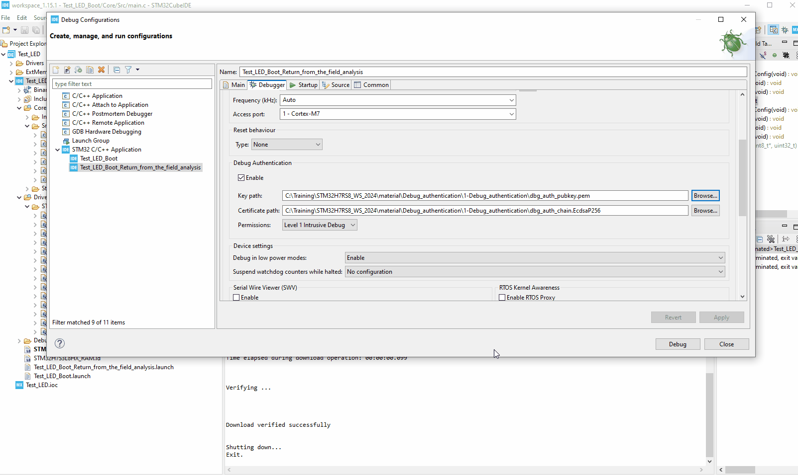
- Please break and then you can debug your application
  

- Close the debug session `Terminate` icon
.

## Step 4 : Let's do a regression and reopen the device
  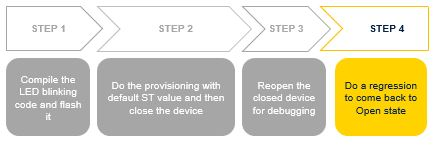
  - Launch STM32CubeProgrammer
  - Select the `shield ` icon
  - Select `DA` tab
  - Click on `Discover`
  - Click on `Close Debug`
  - On the message pop-up : `Target successfully locked`, click `OK`
    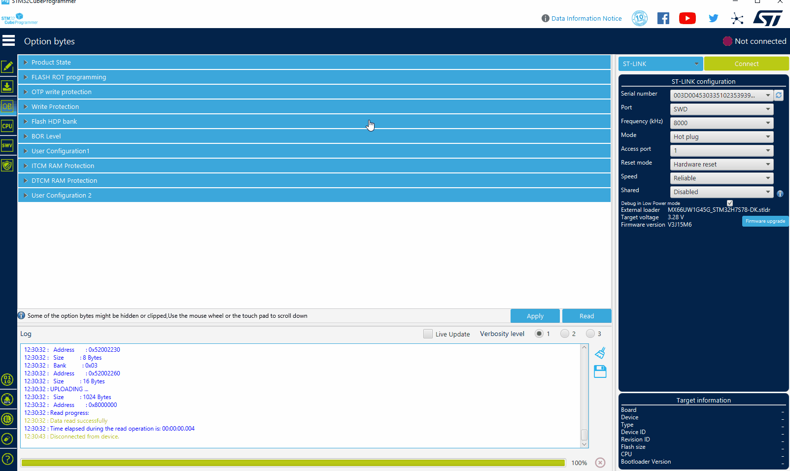
  - Click on `Discover`
  - Update `Key File path`, thanks `Browse...` to set it to your installation path
 - `...STM32H7RSWorkShop-Debug_authentication\1-Debug_authentication\dbg_auth_pubkey.pem`
  - Update `Certificate path`, thanks `Browse...` to set it to your installation path
  - `...STM32H7RSWorkShop-Debug_authentication\1-Debug_authentication\dbg_auth_chain.EcdsaP256 `
  - Click on `Continue`
      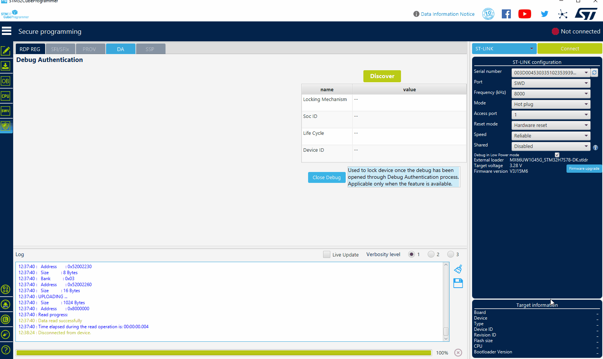
  - Select `Full regression`
  - Select `Execute`
  - On the message pop-up : `Debug Authentication Sucess`, click `OK`
    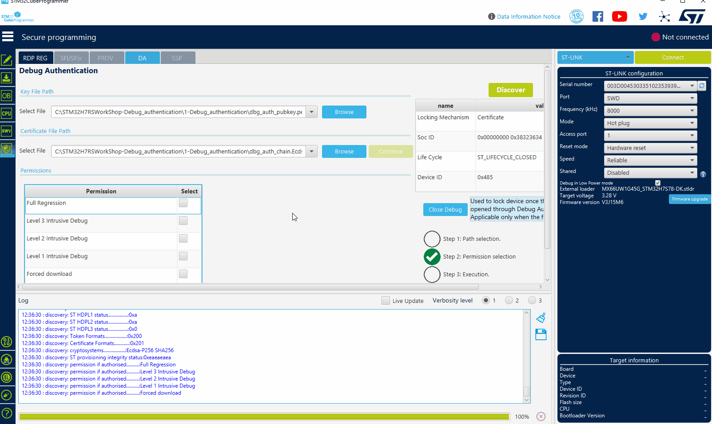
   - Select icon for the option byte `OB`
   - Select `Product State` 
        

